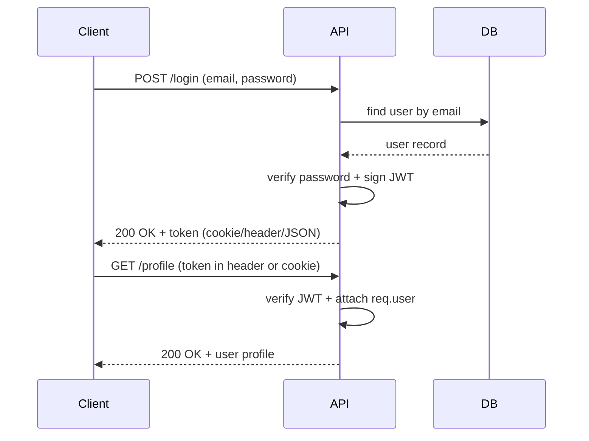

# Backend API Notes

## Register User

**Endpoint**
POST api/v1/users/register

**What it does**
Creates a new user account and returns an auth token on success.

### Request Body
Content-Type: application/json

**Example**
```
{
  "fullName": {
    "firstName": "John",
    "lastName": "Doe"
  },
  "email": "john@example.com",
  "password": "secret123"
}
```

**Fields**
| Field | Type | Required | Notes |
| --- | --- | --- | --- |
| fullName.firstName | string | Yes | Must not be empty; min length 3 |
| fullName.lastName | string | Yes | Must not be empty; min length 3 |
| email | string | Yes | Must be a valid email format |
| password | string | Yes | Min length 6 |

### Success Response
**Status**: 201 Created

```
{
  "statusCode": 200,
  "data": {
    "user": {
      "_id": "661f2d2b0a0a0a0a0a0a0a0a",
      "fullName": {
        "firstName": "John",
        "lastName": "Doe"
      },
      "email": "john@example.com",
      "socketId": null,
      "__v": 0
    },
    "token": "eyJhbGciOiJIUzI1NiIsInR5cCI6IkpXVCJ9..."
  },
  "message": "User Registered Successfully"
}
```

### Error Responses
| Status | When it happens |
| --- | --- |
| 400 Bad Request | Validation error or missing/empty fields |
| 409 Conflict | User with the email already exists |
| 500 Internal Server Error | Unexpected error while registering user |

## Login User

**Endpoint**
POST api/v1/users/login

**What it does**
Authenticates a user and returns an auth token on success.

### Request Body
Content-Type: application/json

**Example**
```
{
  "email": "john@example.com",
  "password": "secret123"
}
```

**Fields**
| Field | Type | Required | Notes |
| --- | --- | --- | --- |
| email | string | Yes | Must be a valid email format |
| password | string | Yes | Min length 6 |

### Success Response
**Status**: 200 OK

```
{
  "statusCode": 200,
  "data": {
    "token": "eyJhbGciOiJIUzI1NiIsInR5cCI6IkpXVCJ9..."
  },
  "message": "User Logged in Successfully"
}
```

### Error Responses
| Status | When it happens |
| --- | --- |
| 400 Bad Request | Validation error (invalid email or password length) |
| 401 Unauthorized | Email and password are required, or password is invalid |
| 404 Not Found | User not found |
| 500 Internal Server Error | Unexpected error while logging in |

## Auth Flow (Token + Profile)

**Summary**
Login creates a JWT token. The client must send that token on every protected request. If no token is sent (or it is expired), `/profile` returns 401.

**Token usage**
- Send as header: `Authorization: Bearer <token>`
- Or send as cookie: `authToken=<token>` (if the client supports cookies)

**/profile behavior**
- Logged in + token included: 200 OK
- Not logged in / missing token / expired token: 401 Unauthorized

**Diagram**

